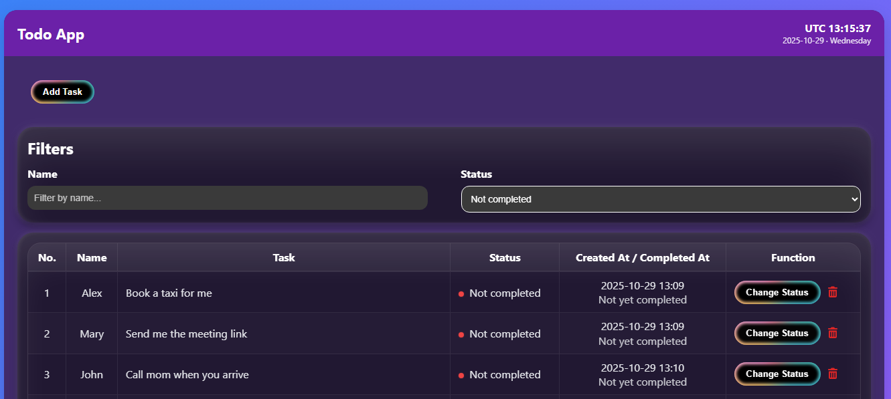
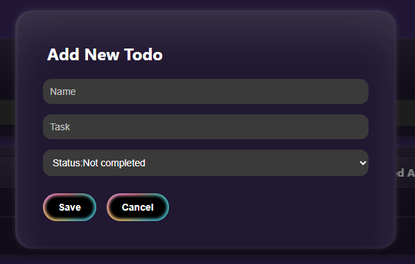

# Todo Application - Full Stack Project

A modern, full-stack todo application built with **React**, **NestJS**, and **MongoDB**, containerized using Docker. This open-source project demonstrates a complete full-stack architecture with proper service separation and network isolation for enhanced security.



## 🚀 Technology Stack

### Frontend
- **React** (v19.2.0) - Modern UI library
- **React Scripts** - Build tooling
- **Font Awesome** - Icon library

### Backend
- **NestJS** (v11.0.1) - Progressive Node.js framework built with TypeScript
- **TypeScript** - Type-safe JavaScript
- **Express** - HTTP server (via NestJS platform)

### Database
- **MongoDB** - NoSQL document database
- **Mongoose** (v7.6.0) - MongoDB object modeling

### DevOps
- **Docker** & **Docker Compose** - Containerization and orchestration

## 🏗️ Architecture

This application is built using a microservices architecture with three separate Docker containers:

1. **React Container** (`react-container`) - Frontend application
   - Exposed on port `3000` for external access
   - Connected to internal Docker network

2. **NestJS Container** (`node-container`) - Backend API
   - Runs on internal Docker network only (not exposed externally)
   - Communicates with MongoDB via internal network

3. **MongoDB Container** (`mongo-container`) - Database
   - Runs on internal Docker network only (not exposed externally)
   - Ensures maximum security by isolating the database



## ✨ Features

### Core Functionality
- ✅ **Add Tasks** - Assign tasks to specific individuals
- ✅ **Task Management** - View task registration and completion dates in a structured table
- ✅ **Status Updates** - Change task status (completed/pending)
- ✅ **Task Deletion** - Remove tasks from the list
- ✅ **Visual Indicators** - Color-coded status indicators:
  - 🟢 Green indicator for completed tasks
  - 🔴 Red indicator for pending/incomplete tasks

### Advanced Features
- 🔍 **Real-time Filtering** - Live search and filter functionality based on:
  - Person name
  - Task status (completed/pending)
- 📄 **Pagination** - Displays 10 records per page with navigation controls
- 📊 **Task Tracking** - Complete audit trail with registration and completion timestamps

## 🔒 Security Features

- **Network Isolation** - Only the React frontend is exposed externally (port 3000)
- **Internal Communication** - Backend and MongoDB communicate exclusively through Docker's internal network (`my-network`)
- **No External Database Exposure** - MongoDB is completely isolated from external access

## 📦 Installation & Setup

### Prerequisites
- Docker
- Docker Compose

### Getting Started

1. **Clone the repository**
   ```bash
   git clone https://github.com/mahmudshahedi/fullstack-todo
   cd fullstack-todo
   ```

2. **Build and start all containers**
   
   Navigate to the root directory of the project and run:
   ```bash
   docker-compose up -d
   ```

   This command will:
   - Build the React frontend container
   - Build the NestJS backend container
   - Pull and start the MongoDB container
   - Create the internal Docker network (`my-network`)
   - Establish connections between all services

3. **Access the application**
   
   Open your browser and navigate to:
   ```
   http://localhost:3000
   ```

   The application will be running on port **3000**, and you can start managing your tasks immediately!

## 🛠️ Development

This project is **open-source** and **extensible**. You can:

- Modify the frontend components in `frontend/src/`
- Update backend services in `backend/src/`
- Extend the MongoDB schema as needed
- Add new features and functionality

All containers are configured with volume mounts for hot-reloading during development.

## 📱 Usage

1. **Adding Tasks**: Click the add button to create a new task assigned to a person
2. **Filtering**: Use the filter card to search by person name or filter by status
3. **Status Management**: Click on task status to toggle between completed and pending
4. **Navigation**: Use pagination controls to navigate through task pages (10 tasks per page)

## 📺 Demo & Tutorial

For a comprehensive video tutorial and walkthrough of the application, visit:

**🎥 YouTube Channel**: https://youtu.be/cp0jD2RW8to
**🔗 LinkedIn**: https://www.linkedin.com/in/mahmud-shahedi-14bb14374/

## 🤝 Contributing

This is an open-source project. Contributions, issues, and feature requests are welcome!

## 📄 License

This project is open-source and available for modification and distribution.

---

**Built with ❤️ using React, NestJS, and MongoDB**

